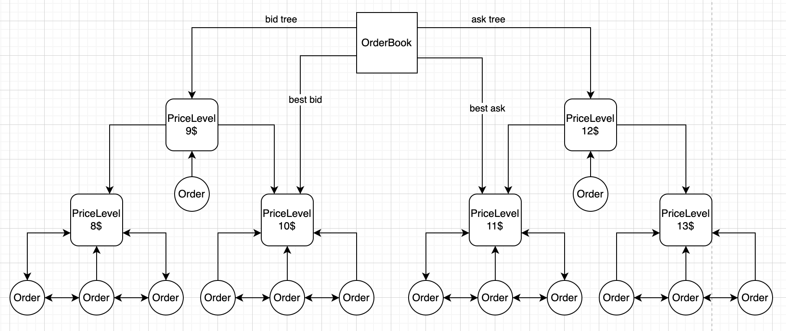

<!-- <p align="center">
    <a href="https://lpthong90.dev/rails-messenger"></a>
</p>-->
<p align="center">
    <em>A demo project is a simple order matching engine which using double linked list and AVL tree.</em>
</p>

---

**Documentation**: <a href="https://lpthong90.dev/python-order-matching-engine" target="_blank">https://lpthong90.dev/python-order-matching-engine</a>

**Source  Code**: <a href="https://github.com/lpthong90/python-order-matching-engine" target="_blank">https://github.com/lpthong90/python-order-matching-engine</a>

---

# Ideas

Order books involve three primary actions: adding a new order, canceling an existing order, and executing an order. 

When adding a new order, the system searches for the corresponding price level and then either adds the order to an existing level or initializes a new one. 

When canceling an order, the system searches for and removes it from the relevant price level's order list.

When executing an order, the system searches for all orders on the opposite side that match it. If matching orders exist, the system reduces the volume size of the order and retries until no matching orders remain. If an order is only partially filled, a new price level is created for the remaining volume.

Price levels without any related orders are removed to maintain efficiency in the order book.

# Diagrams

Model diagram:



[//]: # (Add new order flow diagram:)

[//]: # ()
[//]: # (Add cancel order flow diagram:)

[//]: # ()
[//]: # (Add execute order flow diagram:)


# Models
``` python
class Order:
    def __init__(self, id: ID_TYPE, price: float, volume: float, side: SideType):
        self.id: ID_TYPE = id
        self.price: float = price
        self.volume: float = volume
        self.origin_volume = volume
        self.side: SideType = side  # 'BUY' 'SELL'

        self.price_level: Optional[PriceLevel] = None

class PriceLevel:
    def __init__(self, price: float):
        self.price: float = price
        self.total_volume: float = 0
        self.orders: LinkedList[int, Order] = LinkedList[int, Order]()

class PriceLevelAVLTree(AVLTree):
    def __init__(self):
        super().__init__()

class OrderBook:
    def __init__(self):
        self.bids_tree: PriceLevelAVLTree = PriceLevelAVLTree()
        self.asks_tree: PriceLevelAVLTree = PriceLevelAVLTree()
        self.best_bid_price_level: Optional[PriceLevel] = None
        self.best_ask_price_level: Optional[PriceLevel] = None

        self.price_levels: Dict = {}

class MatchingEngine:
    def __init__(self, order_book: Optional[OrderBook]):
        self.order_book = order_book or OrderBook()

        self.orders: Dict[int, Order] = {}
        self.filled_orders: Dict[int, Order] = {}
```


# Complexity

Assume with `m` is number of price levels, `n` is number orders in each price level, `l` is number of matched price levels; then we have:

- Add new order:
  - `O(log(m))` if related price level isn't existed
  - `O(1)` if otherwise
- Cancel order:
  - `O(log(m))` if related price level is removed
  - `O(1)` if otherwise
- Execute order: 
  - `O(n * l * log(m))`

# References
https://web.archive.org/web/20110219163448/http://howtohft.wordpress.com/2011/02/15/how-to-build-a-fast-limit-order-book/
